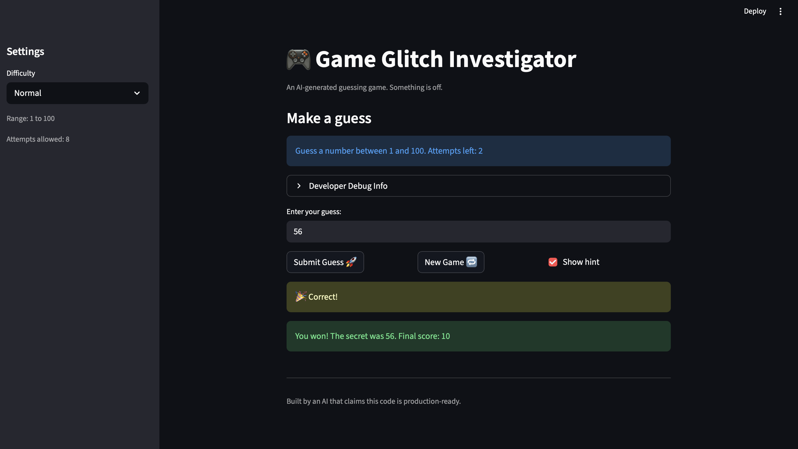

# 🎮 Game Glitch Investigator: The Impossible Guesser

## 🚨 The Situation

You asked an AI to build a simple "Number Guessing Game" using Streamlit.
It wrote the code, ran away, and now the game is unplayable. 

- You can't win.
- The hints lie to you.
- The secret number seems to have commitment issues.

## 🛠️ Setup

1. Install dependencies: `pip install -r requirements.txt`
2. Run the broken app: `python -m streamlit run app.py`

## 🕵️‍♂️ Your Mission

1. **Play the game.** Open the "Developer Debug Info" tab in the app to see the secret number. Try to win.
2. **Find the State Bug.** Why does the secret number change every time you click "Submit"? Ask ChatGPT: *"How do I keep a variable from resetting in Streamlit when I click a button?"*
3. **Fix the Logic.** The hints ("Higher/Lower") are wrong. Fix them.
4. **Refactor & Test.** - Move the logic into `logic_utils.py`.
   - Run `pytest` in your terminal.
   - Keep fixing until all tests pass!

## 📝 Document Your Experience

- [x] Describe the game's purpose: This is a number guessing game where the player tries to guess a secret number within a set number of attempts. The game gives hints after each guess to tell you whether to go higher or lower, and tracks your score across attempts.
- [x] Detail which bugs you found: The hints were backwards (guessing too high told you to go higher instead of lower). On even-numbered attempts the secret was secretly converted to a string making it impossible to win. The New Game button used a hardcoded range of 1-100 regardless of difficulty and didn't reset the game status, so after losing you couldn't start fresh.
- [x] Explain what fixes you applied: Flipped the hint messages in check_guess so "Too High" says "Go lower!" and "Too Low" says "Go higher!". Removed the string conversion bug so the secret stays an integer on all attempts. Fixed the New Game button to use the correct difficulty range and reset score, status, and history properly. Also moved game logic into logic_utils.py and fixed the hardcoded range text in the UI.

## 📸 Demo

- [x] 

## 🚀 Stretch Features

- [ ] [If you choose to complete Challenge 4, insert a screenshot of your Enhanced Game UI here]
